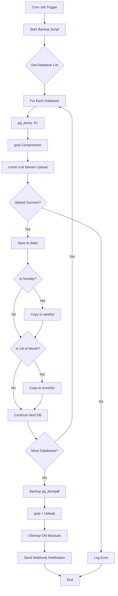
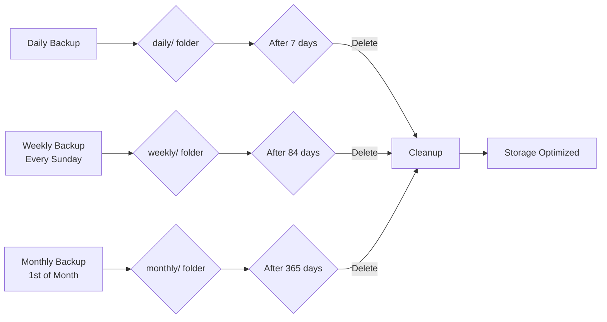
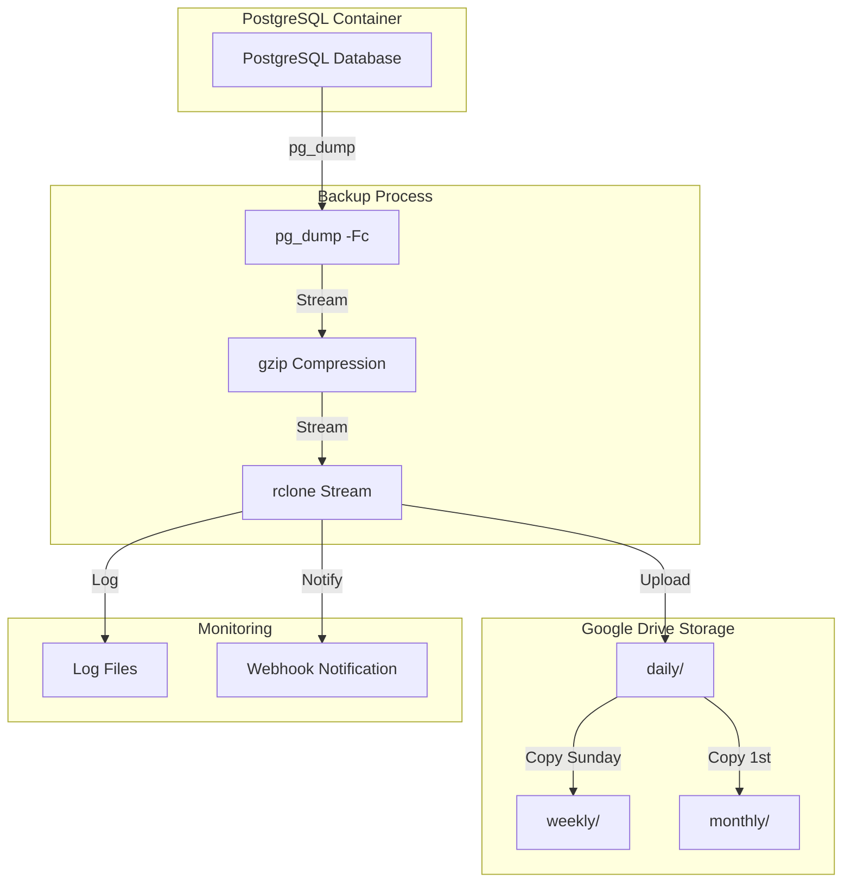
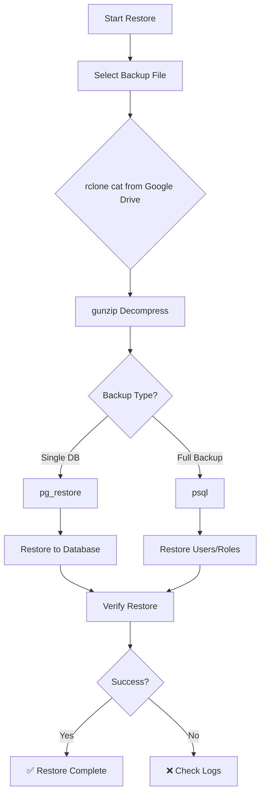

# PostgreSQL Backup với Rclone - Stream Upload

[](https://opensource.org/licenses/MIT)

Hệ thống backup PostgreSQL tự động lên Google Drive sử dụng Rclone với stream upload, không tốn dung lượng đĩa local.

## ✨ Tính năng

- 🚀 **Stream Upload**: Backup trực tiếp từ PostgreSQL → gzip → Google Drive, không tốn dung lượng đĩa
- 📦 **Compression**: Tự động nén với gzip (giảm ~95% dung lượng)
- 📅 **Retention Policy**: Daily (7 ngày), Weekly (12 tuần), Monthly (12 tháng)
- 🔔 **Webhook Notification**: Optional webhook để nhận thông báo backup
- 📝 **Logging**: Logging đầy đủ với timestamp và kết quả chi tiết
- ⚙️ **Automated**: Cron job tự động chạy hàng ngày

## 📊 Flow Logic Backup

### Backup Process Flow



### Retention Policy Flow



### Backup Architecture



### Restore Process Flow



## 📋 Yêu cầu

- Docker với PostgreSQL container
- Rclone đã cài đặt
- Google Drive account với API access
- Bash shell

## 🚀 Quick Start

### 1. Clone repository

```bash
git clone https://github.com/nguyenngothuong/backup-rclone.git
cd backup-rclone
```

### 2. Cài đặt Rclone

```bash
curl https://rclone.org/install.sh | sudo bash
```

### 3. Cấu hình Rclone

```bash
bash scripts/setup_rclone.sh
# Hoặc
rclone config
```

### 4. Cấu hình script backup

Sửa các biến trong `scripts/backup_postgresql.sh`:

```bash
CONTAINER="your_postgresql_container"
REMOTE="your-remote:backup-path"
BACKUP_DIR="/path/to/backups"
```

### 5. Test backup

```bash
bash scripts/test_backup.sh
```

### 6. Setup cron job

```bash
crontab -e
# Thêm dòng sau (chạy hàng ngày lúc 2:36 AM)
36 2 * * * /bin/bash /path/to/scripts/cron_backup.sh >/dev/null 2>&1
```

## 📁 Cấu trúc Project

```
backup-rclone/
├── scripts/
│   ├── backup_postgresql.sh    # Script backup chính
│   ├── test_backup.sh          # Script test backup
│   ├── setup_rclone.sh         # Script setup Rclone
│   └── cron_backup.sh          # Cron wrapper script
└── documentation/
    └── SETUP_GUIDE.md          # Hướng dẫn chi tiết
```

## 🔧 Cấu hình

### Retention Policy

Mặc định:
- **Daily**: 7 ngày
- **Weekly**: 12 tuần (84 ngày)
- **Monthly**: 12 tháng (365 ngày)

Có thể thay đổi trong script `backup_postgresql.sh`.

### Webhook Notification

Để enable webhook, thêm `WEBHOOK_URL` vào script:

```bash
WEBHOOK_URL="https://hooks.slack.com/services/YOUR/WEBHOOK/URL"
```

Format payload: JSON với thông tin backup (success/failed, số databases, duration, etc.)

## 📊 Backup Structure trên Google Drive

```
your-remote:backup-path/
├── daily/
│   ├── database1_backup_20251101_114649.dump.gz
│   ├── database2_backup_20251101_114649.dump.gz
│   └── full_backup_all_20251101_114649.sql.gz
├── weekly/
│   └── ... (copied từ daily mỗi Chủ nhật)
└── monthly/
    └── ... (copied từ daily mỗi ngày 1)
```

## 🔄 Restore

### Restore một database

```bash
rclone cat your-remote:backup-path/daily/database_backup_20251101.dump.gz | \
  gunzip | \
  docker exec -i postgresql_container pg_restore -U postgres -d database_name --clean --if-exists
```

### Restore full backup

```bash
rclone cat your-remote:backup-path/daily/full_backup_all_20251101.sql.gz | \
  gunzip | \
  docker exec -i postgresql_container psql -U postgres
```

## 📖 Documentation

Xem [SETUP_GUIDE.md](documentation/SETUP_GUIDE.md) để biết hướng dẫn chi tiết.

## ⚠️ Troubleshooting

### Rclone token hết hạn

```bash
rclone config reconnect your-remote:
```

### Backup fail

1. Kiểm tra kết nối: `rclone lsd your-remote:`
2. Kiểm tra container: `docker ps | grep postgres`
3. Xem logs: `cat /path/to/backups/logs/backup_*.log`

## 🤝 Contributing

Contributions are welcome! Please feel free to submit a Pull Request.

## 📝 License

MIT License - Xem file LICENSE để biết chi tiết.

## 🙏 Acknowledgments

- [Rclone](https://rclone.org/) - Tool để sync files với cloud storage
- PostgreSQL - Database system

## 📞 Support

Nếu gặp vấn đề, vui lòng tạo issue trên GitHub repository.

