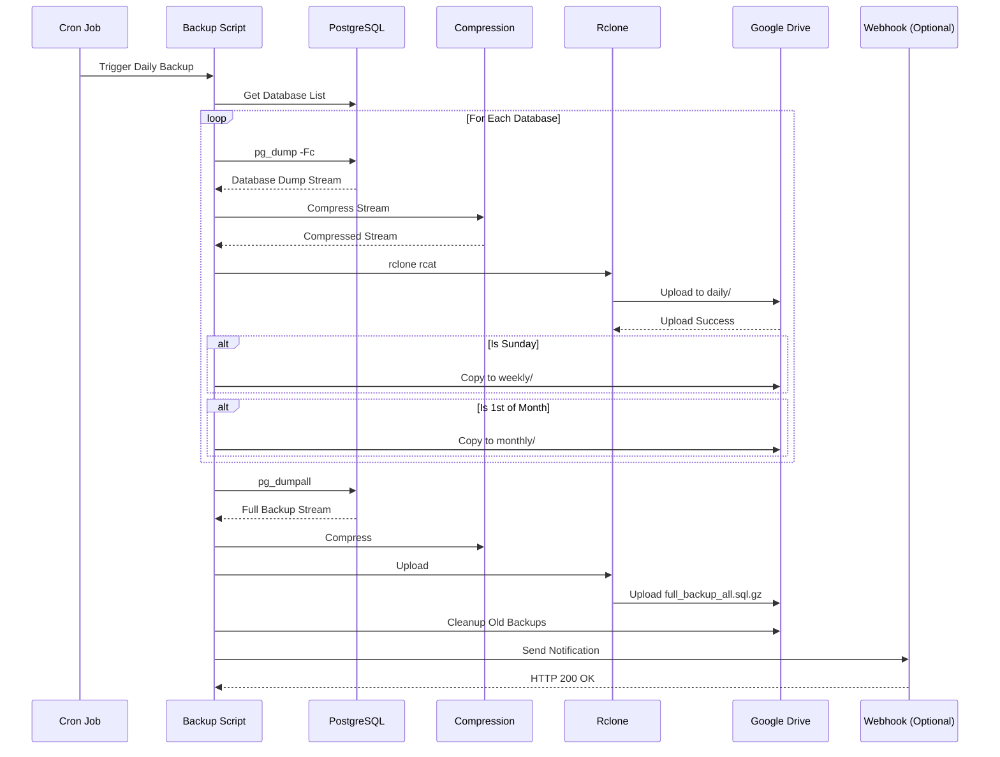
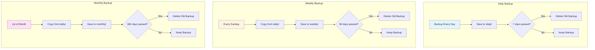
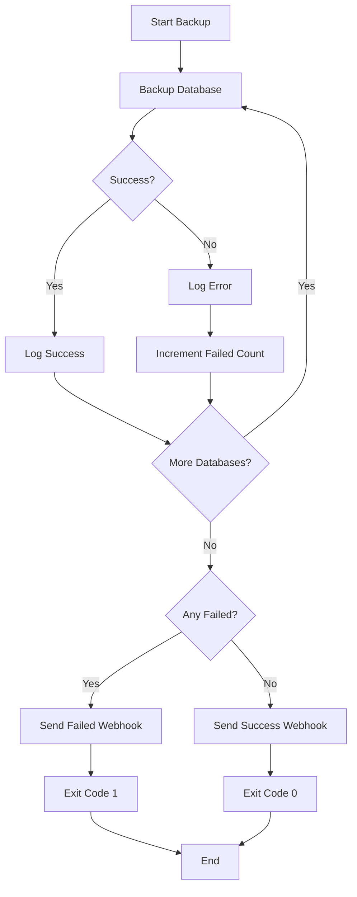
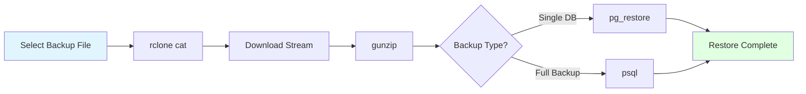

# 📦 PostgreSQL Backup với Rclone - Hướng Dẫn Setup

# 📦 PostgreSQL Backup với Rclone - Hướng Dẫn Setup

## 🎯 Tổng quan

Hệ thống backup PostgreSQL tự động lên Google Drive sử dụng Rclone với các tính năng:
- ✅ Backup stream (không tốn dung lượng đĩa local)
- ✅ Compression tự động (gzip)
- ✅ Retention policy: Daily (7 ngày), Weekly (12 tuần), Monthly (12 tháng)
- ✅ Webhook notification (optional)
- ✅ Logging đầy đủ

## 📊 Backup Flow Diagram

### Tổng quan Backup Process



### Retention Policy Logic



### Error Handling Flow



## 📋 Yêu cầu

- Docker với PostgreSQL container
- Rclone đã cài đặt
- Google Drive account với quyền truy cập API
- Bash shell

## 🚀 Cài đặt

### Bước 1: Cài đặt Rclone

```bash
curl https://rclone.org/install.sh | sudo bash
```

Hoặc cài từ package manager:
```bash
# Ubuntu/Debian
sudo apt install rclone

# CentOS/RHEL
sudo yum install rclone
```

### Bước 2: Cấu hình Rclone với Google Drive

Chạy script setup:
```bash
bash scripts/setup_rclone.sh
```

Hoặc cấu hình thủ công:
```bash
rclone config
```

**Options cần chọn:**
- `n` - New remote
- Tên remote (ví dụ: `gdrive`)
- `drive` - Storage type (Google Drive)
- Client ID và Secret (dùng mặc định hoặc từ Google Cloud Console)
- `y` - Use auto config (cần browser để authorize)
- `drive.file` - Scope (hoặc `drive` cho full access)

### Bước 3: Kiểm tra kết nối

```bash
# List folders trên Google Drive
rclone lsd gdrive:

# Kiểm tra dung lượng
rclone about gdrive:
```

### Bước 4: Cấu hình Script Backup

Sửa các biến trong `scripts/backup_postgresql.sh`:

```bash
CONTAINER="postgresql_container"  # Tên container của bạn
REMOTE="gdrive:backups"          # Remote name và path
BACKUP_DIR="/path/to/backups"    # Thư mục lưu logs
WEBHOOK_URL=""                   # Optional: Webhook URL
```

### Bước 5: Test Backup

```bash
# Test backup 1 database
bash scripts/test_backup.sh
```

**Lưu ý:** Sửa `DB_NAME` trong script test trước khi chạy.

### Bước 6: Setup Cron Job

Thêm vào crontab:
```bash
crontab -e
```

Thêm dòng sau (chạy hàng ngày lúc 2:36 AM):
```bash
36 2 * * * /bin/bash /path/to/scripts/cron_backup.sh >/dev/null 2>&1
```

Hoặc sửa thời gian theo nhu cầu:
```bash
# Chạy hàng ngày lúc 3:00 AM
0 3 * * * /bin/bash /path/to/scripts/cron_backup.sh >/dev/null 2>&1
```

## 📁 Cấu trúc Backup trên Google Drive

```
your-remote:backup-path/
├── daily/          # Backup hàng ngày (giữ 7 ngày)
│   ├── database1_backup_20251101_114649.dump.gz
│   ├── database2_backup_20251101_114649.dump.gz
│   └── full_backup_all_20251101_114649.sql.gz
├── weekly/         # Backup hàng tuần (Chủ nhật, giữ 12 tuần)
│   └── ...
└── monthly/        # Backup hàng tháng (ngày 1, giữ 12 tháng)
    └── ...
```

## 🔧 Customization

### Thay đổi Retention Policy

Sửa trong `scripts/backup_postgresql.sh`:

```bash
# Daily: Giữ 7 ngày
OLD_DATE_DAILY=$(date -d '7 days ago' +%Y%m%d)  # Đổi 7 thành số ngày

# Weekly: Giữ 12 tuần (84 ngày)
OLD_DATE_WEEKLY=$(date -d '84 days ago' +%Y%m%d)  # Đổi 84 thành số ngày

# Monthly: Giữ 12 tháng (365 ngày)
OLD_DATE_MONTHLY=$(date -d '365 days ago' +%Y%m%d)  # Đổi 365 thành số ngày
```

### Thêm Webhook Notification

Thêm `WEBHOOK_URL` vào script:

```bash
WEBHOOK_URL="https://hooks.slack.com/services/YOUR/WEBHOOK/URL"
```

Hoặc để trống để disable:
```bash
WEBHOOK_URL=""
```

## 🔄 Restore từ Backup

### Restore Flow Diagram



### Restore một database

```bash
# Download và restore trực tiếp từ Google Drive (stream)
rclone cat your-remote:backup-path/daily/database_backup_20251101.dump.gz | \
  gunzip | \
  docker exec -i postgresql_container pg_restore -U postgres -d database_name --clean --if-exists
```

### Restore full backup (users, roles, permissions)

```bash
rclone cat your-remote:backup-path/daily/full_backup_all_20251101.sql.gz | \
  gunzip | \
  docker exec -i postgresql_container psql -U postgres
```

## 📊 Monitoring

### Xem logs

```bash
# Log mới nhất
ls -lt /path/to/backups/logs/*.log | head -1 | awk '{print $NF}' | xargs tail -f

# Log cron hôm nay
cat /path/to/backups/logs/cron_backup_$(date +%Y%m%d).log
```

### Kiểm tra backup trên Google Drive

```bash
# List tất cả backups
rclone lsf your-remote:backup-path/daily/

# Xem kích thước
rclone size your-remote:backup-path/daily/
```

## ⚠️ Troubleshooting

### Rclone token hết hạn

```bash
# Reconnect
rclone config reconnect your-remote:
```

### Backup fail với lỗi "Network is unreachable"

- Kiểm tra kết nối internet
- Kiểm tra firewall
- Test kết nối: `rclone lsd your-remote:`

### Database không tồn tại

- Kiểm tra tên container: `docker ps | grep postgres`
- Kiểm tra tên database: `docker exec container psql -U postgres -c "\l"`

## 📝 License

MIT License - Xem file LICENSE để biết chi tiết.

## 🤝 Contributing

Contributions are welcome! Please feel free to submit a Pull Request.

## 📞 Support

Nếu gặp vấn đề, vui lòng tạo issue trên GitHub repository.

